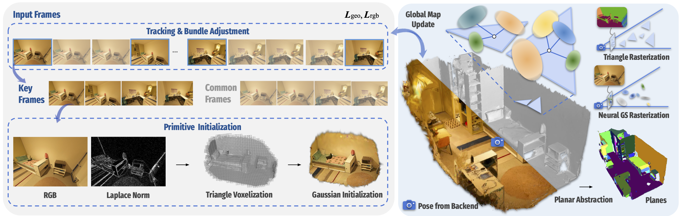

# PLANING: A Loosely Coupled Triangle-Gaussian Framework for Streaming 3D Reconstruction

[Changjian Jiang*](https://scholar.google.com/citations?hl=en&user=V4miywEAAAAJ), [Kerui Ren*](https://cskrren.github.io/), [Xudong Li](https://orcid.org/0009-0003-8355-2491), [Kaiwen Song](https://orcid.org/0009-0007-1199-5380), [Linning Xu](https://eveneveno.github.io/lnxu), [Tao Lu](https://scholar.google.com/citations?user=Ch28NiIAAAAJ&hl=en), [Junting Dong](https://scholar.google.com/citations?hl=en&user=dEzL5pAAAAAJ), [Yu Zhang†](https://person.zju.edu.cn/zhangyu/), [Bo Dai](https://daibo.info/), [Mulin Yu](https://mulinyu.github.io/)

## Overview

**PLANING** introduces a loosely coupled **triangle-Gaussian** representation and a monocular streaming framework that jointly achieves accurate geometry, high-fidelity rendering, and efficient planar abstraction for **embodied AI** applications.

## Pipline

**Pipeline of PLANING.** We develop a streaming reconstruction framework that takes unposed monocular image sequences as input and comprises a frontend for camera tracking, a backend for global pose optimization, and a mapper for scene reconstruction. Specifically, the mapper incorporates an efficient primitive initialization strategy to reduce redundancy. The recontructed triangle soup further enables efficient planar abstraction, facilitating a range of downstream tasks.